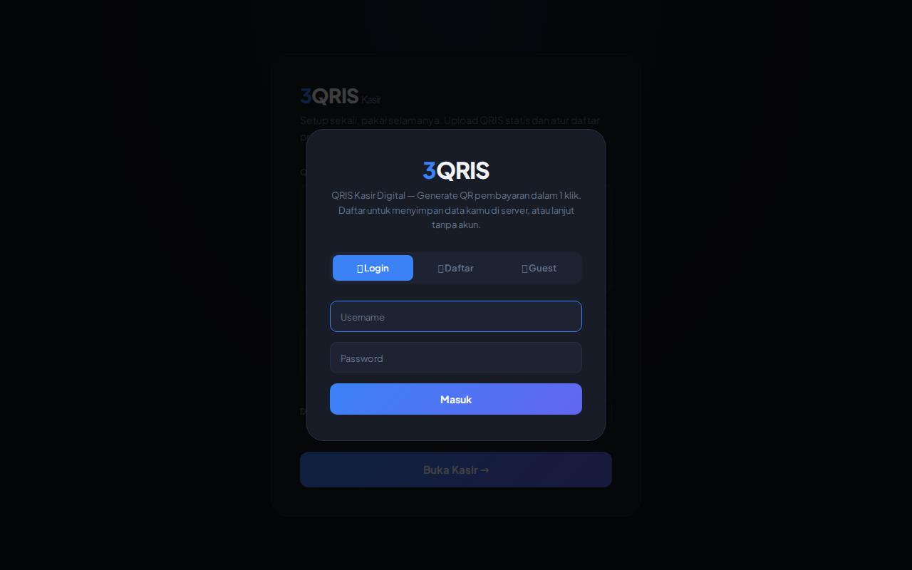
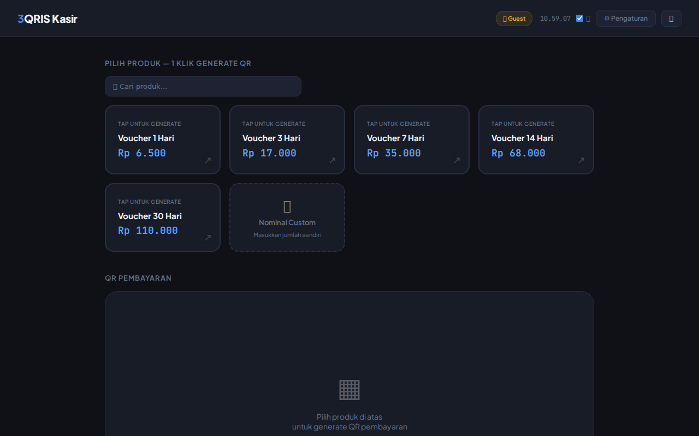
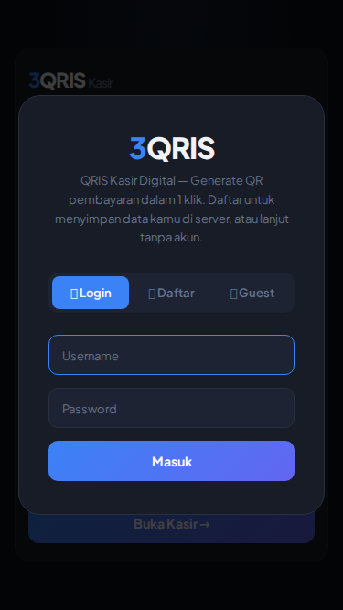

<div align="center">
  <h1>3QRIS Kasir 🔒</h1>
  <p><strong>Ubah QRIS Statis menjadi QRIS Dinamis — 1 Klik</strong></p>
  <p>
    Express.js + SQLite + Vanilla JS · Zero QR API dependencies · Dark theme
  </p>
  <p>
    <a href="#fitur">Fitur</a> •
    <a href="#demo-cara-pakai">Demo</a> •
    <a href="#installasi">Install</a> •
    <a href="#api-endpoints">API</a> •
    <a href="#tech-stack">Tech Stack</a> •
    <a href="#lisensi">Lisensi</a>
  </p>
  <br>
  <a href="https://render.com/deploy?repo=https://github.com/triagustian-net/3QRIS">
    
  </a>
  <br><br>
  <table>
    <tr>
      <td></td>
      <td></td>
      <td></td>
    </tr>
  </table>
</div>

---

**3QRIS Kasir** adalah aplikasi kasir digital berbasis web yang mengonversi **QRIS statis** (satu QR untuk semua transaksi) menjadi **QRIS dinamis** (QR khusus dengan nominal sesuai produk yang dipilih pelanggan). Tanpa API pihak ketiga — semua QR di-generate di server sendiri.

Cocok untuk **warung, UMKM, toko kecil, atau siapa pun** yang mau menerima pembayaran QRIS tanpa ribet setup mPOS/integrasi bank.

---

## ✨ Fitur

### 🔐 Autentikasi
- **Login / Register** — Akun tersimpan di server, bisa dipakai di perangkat mana pun
- **Guest Mode** — Langsung pakai tanpa daftar, data disimpan di localStorage browser
- **Role System** — Admin & User, user pertama otomatis jadi admin
- **JWT Authentication** — Token-based, bcrypt password hashing

### 🛒 Kasir
- **📷 Scan QRIS Statis** — Upload gambar QRIS, auto-scan pakai jsQR di browser
- **📝 Paste Manual** — Atau paste raw string QRIS (mulai `000201...`)
- **⚡ 1 Klik Generate QR** — Tap produk → QRIS dinamis dengan nominal muncul
- **🔢 Kode Unik (1-3 digit)** — Tambah kode unik otomatis tiap transaksi (pilihan: 1-9 / 1-99 / 1-999) hindari bentrok nominal pas ngecek mutasi
- **💰 Fee Layanan** — Tambah biaya layanan ke customer (Rp 500 – Custom)
- **🔗 Link Pembayaran** — Copy link untuk WA atau embed di website toko
- **🔍 Cari Produk** — Filter cepat dari daftar produk
- **🔊 Sound Effect** — Notifikasi suara tiap transaksi
- **🛒 Manajemen Produk** — Tambah/hapus produk dengan harga

### 🛡 Admin Panel
- **Dashboard Statistik** — Total user, transaksi, revenue, transaksi hari ini
- **Manajemen User** — Lihat semua user + jumlah transaksi + revenue
- **Promote/Demote** — Naikkan user jadi admin, atau turunkan admin lain
- **Semua Transaksi** — Riwayat transaksi dari semua user

### 🎨 Tampilan
- **🌙 Dark Theme** — Modern, gradien, enak dipandang
- **📱 Responsive** — Otomatis menyesuaikan HP, tablet, & desktop
- **🖥 SPA** — Single Page Application, tanpa reload

---

## 📸 Tampilan

> *Screenshot coming soon — upload screenshot setup screen, kasir + QR, admin panel*

| Desktop | Mobile |
|---------|--------|
|  |  |

---

## 🚀 Installasi

### Persyaratan
- **Node.js** v18+
- **npm** (bundled)

### Langkah

```bash
# 1. Clone
git clone https://github.com/triagustian-net/3QRIS.git
cd 3QRIS

# 2. Install dependencies
npm install

# 3. Copy & edit env
cp .env.example .env
# ganti JWT_SECRET dengan random string minimal 32 karakter
# (opsional) PAYMENT_API_KEY — untuk integrasi QRIS ke website external

# 4. Jalankan
node server.js
```

Atau pake **Docker** (lebih gampang):

```bash
# Clone & masuk folder
git clone https://github.com/triagustian-net/3QRIS.git
cd 3QRIS

# Jalanin — tinggal 1 perintah
JWT_SECRET="ganti-dengan-random-string" docker compose up -d

# Buka http://localhost:5001
```

Buka **http://localhost:5001** — langsung muncul halaman auth login/register/guest.

### Deploy Production

```bash
# Set environment variables (JWT_SECRET wajib!)
export JWT_SECRET="random-string-min-32-karakter"
export PORT=5001
export NODE_ENV=production
export TRUST_PROXY=true   # jika di belakang reverse proxy (Nginx/Cloudflare)

node server.js
```

---

## 🔌 Integrasi QRIS ke Website External

Developer bisa pake 3QRIS di website mereka **tanpa perlu clone/setup full aplikasi**.

### Level 1 — Link Pembayaran (paling gampang)

Cocok untuk: toko online, landing page, WhatsApp order.

```javascript
// Panggil API → dapet payment link → redirect customer
const res = await fetch("https://server-3qris-kamu.com/api/payment-link", {
  method: "POST",
  headers: {
    "x-api-key": "PAYMENT_API_KEY_MU",
    "Content-Type": "application/json"
  },
  body: JSON.stringify({
    qris: "000201010211...",      // QRIS statis kamu
    name: "Indomie Goreng",       // nama produk
    price: 15000,                 // harga (tanpa kode unik)
    kode_unik_digits: 3           // 1, 2, atau 3 digit
  })
});

const data = await res.json();
// data.data.payment_url → redirect customer ke halaman bayar
// data.data.qris_string → raw QRIS (generate QR sendiri)
// data.data.amount     → total termasuk kode unik
```

### Level 2 — Tampilkan QR di Website Sendiri

Gak perlu redirect — QR ditampilkan langsung di halaman kamu.

```javascript
async function tampilkanQR(nama, harga) {
  const res = await fetch("https://server-3qris-kamu.com/api/payment-link", {
    method: "POST",
    headers: {
      "x-api-key": "API_KEY_MU",
      "Content-Type": "application/json"
    },
    body: JSON.stringify({ qris: QRIS_STATIC, name: nama, price: harga })
  });
  const data = await res.json();

  // Generate QR dari qris_string (pake library QRCode.js)
  new QRCode(document.getElementById("qrBox"), {
    text: data.data.qris_string,
    width: 200,
    height: 200
  });

  // Tampilkan nominal
  document.getElementById("total").textContent =
    "Rp " + data.data.amount.toLocaleString("id-ID");
}
```

### Setup API Key

Di server 3QRIS kamu, set `.env`:

```bash
PAYMENT_API_KEY=buat-random-key-susah-ditebak
```

Kasih key itu ke developer yang mau integrasi QRIS ke website mereka.

> **Contoh request lengkap** ada di [docs/api.http](docs/api.http). Bisa di-run langsung dari VS Code.

---

## 🔒 Security

3QRIS dibangun dengan prinsip **defense in depth**:

| Lapisan | Detail |
|---------|--------|
| **CSP Header** | `script-src 'self'` tanpa `'unsafe-inline'` + `script-src-attr 'none'` — blok semua inline script & event handler |
| **XSS Protection** | `escapeHtml()` di setiap titik `innerHTML` yang pakai data user (7 titik) |
| **SQL Injection** | Semua query pakai parameterized (`?`) placeholder |
| **Rate Limiting** | 200 req/15 menit global, 10 req/15 menit auth endpoint |
| **CORS Whitelist** | Origin terbatas (domain + localhost) |
| **Input Validation** | Server-side: username regex, password length, product name & price bounds |
| **File Blocking** | `.db`, `.env`, `.json`, `.pem`, `.key`, `server.js` dilarang diakses via HTTP |
| **JWT** | Token expiry 30 hari, bcrypt salt 12 rounds |

---

## 🧰 Tech Stack

| Teknologi | Kegunaan |
|-----------|----------|
| **Node.js + Express** | Backend API + static file serving |
| **SQLite3** | Database ringan, zero config |
| **jsonwebtoken** | JWT authentication |
| **bcryptjs** | Password hashing |
| **jsQR** | Scan QR code dari upload gambar |
| **QRCode.js** | Generate QR code dinamis di browser |
| **Vanilla JS** | Frontend SPA (no framework, no build) |

---

## 📁 Struktur Proyek

```
3QRIS/
├── server.js           # Backend — Express routing, auth, API, security middleware
├── index.html          # Frontend SPA — semua UI di 1 file HTML
├── public/
│   └── app.js          # Frontend JS — logic auth, kasir, admin panel
├── docs/
│   └── api.http        # API docs — bisa jalan di VS Code REST Client
├── package.json
├── .env.example        # Template konfigurasi environment
├── .gitignore
├── LICENSE             # MIT License
└── README.md           # File ini
```

---

## 🔥 API Endpoints

### Auth (Public)
| Method | Endpoint | Deskripsi |
|--------|----------|-----------|
| `POST` | `/api/register` | Daftar akun baru |
| `POST` | `/api/login` | Login, dapat JWT token |
| `GET` | `/api/me` | Verifikasi token & dapat data user |

### Config (Login Required)
| Method | Endpoint | Deskripsi |
|--------|----------|-----------|
| `POST` | `/api/save` | Simpan QRIS string & daftar produk |
| `GET` | `/api/load` | Load config user yang login |

### Transactions (Login Required)
| Method | Endpoint | Deskripsi |
|--------|----------|-----------|
| `POST` | `/api/transaction` | Simpan transaksi baru |
| `GET` | `/api/transactions` | Riwayat transaksi user |

### Admin (Admin Only)
| Method | Endpoint | Deskripsi |
|--------|----------|-----------|
| `GET` | `/api/admin/stats` | Statistik dashboard |
| `GET` | `/api/admin/users` | Daftar semua user |
| `GET` | `/api/admin/transactions` | Semua transaksi |
| `POST` | `/api/admin/promote/:id` | Promosikan user → admin |
| `POST` | `/api/admin/demote/:id` | Turunkan admin → user |

> **Auth Header** semua endpoint protected:
> ```
> Authorization: Bearer ***
> ```

### 💳 Payment API (API Key Required)

Endpoint publik untuk **developer external** yang mau integrasi QRIS ke website mereka.

| Method | Endpoint | Deskripsi |
|--------|----------|-----------|
| `POST` | `/api/payment-link` | Generate QRIS dinamis + payment link |

**Header:** `x-api-key: <PAYMENT_API_KEY>` (set di .env)

**Request:**
```json
{
  "qris": "000201010211...",
  "name": "Indomie Goreng",
  "price": 15000,
  "kode_unik_digits": 3
}
```

**Response:**
```json
{
  "success": true,
  "data": {
    "qris_string": "000201010212...",
    "amount": 15123,
    "base_price": 15000,
    "kode_unik": 123,
    "product": "Indomie Goreng",
    "payment_url": "https://serverkamu/pay?d=eyJx..."
  }
}
```

> **Lihat [docs/api.http](docs/api.http)** untuk contoh request lengkap yang bisa di-run langsung di VS Code pakai REST Client.

---

## 🔄 Flow Aplikasi

```
Buka 3QRIS
  ├─ Ada token JWT? → Verifikasi /api/me → Load dari server → Kasir
  ├─ Ada data localStorage? → Guest mode → Kasir
  └─ Tidak ada? → Welcome Modal
        ├─ Login → Kasir (data dari server)
        ├─ Daftar → Setup QRIS & Produk → Kasir
        └─ Guest → Setup QRIS & Produk → Kasir (data di browser)
```

---

## 🤝 Kontribusi

Pull request terbuka! Pastikan:

1. **Tidak menambah inline event handler** — semua event via `addEventListener`
2. **escapeHtml** untuk setiap data user yang masuk `innerHTML`
3. **Parameterized query** untuk setiap operasi database
4. **Uji coba** sebelum pull request

---

## 📄 Lisensi

[MIT](LICENSE) © 2025 Tri Agustian
